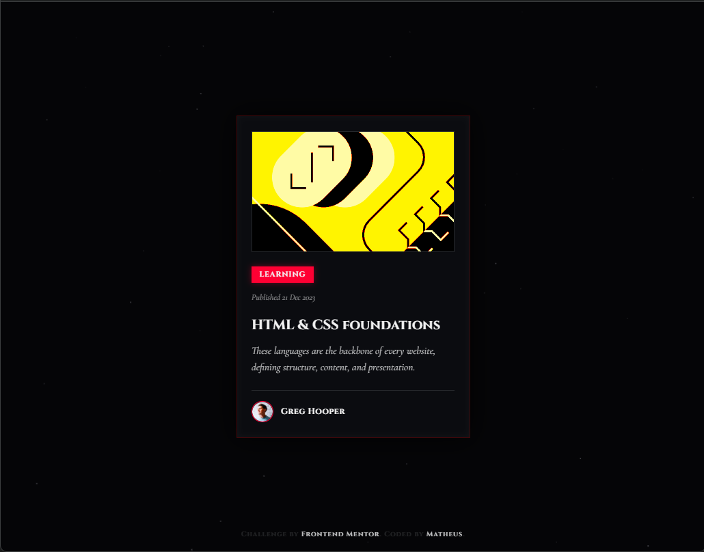

# Blog Preview Card - Vampire Knight Edition 🦇

## 📜 O Desafio

Este projeto é uma releitura do desafio [Blog preview card do Frontend Mentor](https://www.frontendmentor.io/challenges/blog-preview-card-ckPaj01IcS). O objetivo original era construir um card simples seguindo o Box Model. No entanto, decidi escalar o desafio focando em **Direção de Arte e Engenharia Front-end**.

Apliquei uma estética rigorosa de *Monochromatic Dark Fantasy* (inspirada na obra *Vampire Knight*), convertendo um componente padrão em uma peça atmosférica e altamente responsiva.

## 🎨 A Estética e UI Estrita

- **Alto Contraste Controlado:** Uso de cores como `--void-black` (`#050507`) e `--silver-blade` (`#C5C6C7`) para evitar fadiga visual (eye strain) sem perder o peso do tema gótico.
- **O Sangue como Destaque:** O carmesim arterial (`#FF0033`) é a única cor vibrante, reservada estritamente para micro-interações (hover states), criando um ponto focal dramático.
- **Formas Afiadas:** O design foge da web moderna arredondada. O `border-radius` é cravado em `0px`, com linhas finas simulando lâminas e vitrais (`1px solid rgba(197, 198, 199, 0.15)`).

## 🛠️ Stack Tecnológica

Projeto Vanilla, garantindo controle total sobre o DOM e otimização de performance:

- **HTML5:** Semântica estruturada.
- **CSS3:** Flexbox/Grid para o layout, CSS Custom Properties para os Design Tokens, e filtros CSS agressivos (`grayscale`, `invert`, `sepia`, `hue-rotate`) para manipulação de assets de imagem em tempo de execução.
- **JavaScript (ES6+):** Orientação a objetos para renderização do sistema gráfico auxiliar.
- **Canvas API:** Renderização procedural de partículas em 60fps no background.

## ⚙️ Engenharia de Efeitos Visuais

### 1. Sistema de Partículas (Silver Ash)
Construí um motor gráfico leve utilizando a Canvas API para simular cinzas caindo ao fundo. A física foi modelada com base em cinemática simples:
- Uma queda vetorial (`y += velocidade`) combinada com oscilação senoidal (`x += sin(angulo) * amplitude`) para simular a resistência do ar e ventos erráticos, sem sobrecarregar a thread principal da página.

### 2. Manipulação de Imagem via CSS Engine
Em vez de editar o SVG original em ferramentas de design, usei pipelines de filtros CSS para aplicar a direção de arte dinamicamente. O "Selo de Invocação" (a imagem principal) foi invertido e teve seu contraste estourado no estado natural. No `:hover`, um filtro `sepia` com `hue-rotate` explode a imagem no tom avermelhado do tema.

## 📂 Arquitetura do Repositório

/
├── assets/
│   └── images/
│       ├── favicon-32x32.png
│       ├── illustration-article.svg
│       └── image-avatar.webp
├── css/
│   └── style.css
├── js/
│   └── script.js
├── .gitignore
├── index.html
└── README.md